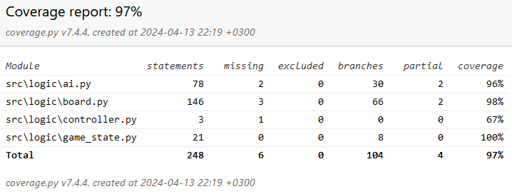

# Testausdokumentti
## Testien käynnistys
Tee testit komennolla
```
poetry run pytest
```

## Testikattavuus


## Testit
Tekoäly on testattu yksikkötesteillä pääosin siten, että tekoälyä vastaan on pelattu, kunnes löytyy bugi (teköäly tekee huonon siirron). Tämän jälkeen bugille on kirjoitettu testi käyttäen samaa pelitilannetta, jolla bugi ilmeentyi, ja tämän avulla korjattu bugi.

Tekoälysta on testattu, että se löytää varman voiton. Tätä on testattu siten, että se löytää 1 siirron päässä olevan voiton, ja myös siten, että se löytää 6 (molemmilta pelaajilta yhteensä) siirron päässä olevan varman voiton.

Tekoälystä on myös testattu, että se ei auta toista pelaajaa tekemällä siirtoa, jonka avulla toinen pelaaja voittaisi. Tätä on myös testattu tilanteessa, jossa tekoäly tietää häviävänsä jokaisella siirrolla. Tekoäly ei siis tee siirtoa, millä toinen pelaaja voittaisi ensi vuorolla, vaikka tekoäly tietäisi, että se häiviäisi kaikilla muillakin siirroilla tulevaisuudessa (paitsi tietenkin, jos se häviää niilläkin ensi vuorolla).

Tekoälystä on testattu, että se valitsee vain laillisia siirtoja myös tilanteessa, missä jotkut sarakkeet ovat jo täynnä.

Tekoälyn pelitilanteiden hyvyyden arviointia on myös testattu. On siis testattu, että tekoäly antaa oikeat arvot eri tilanteissa. Voittavassa tilanteessa testattu, että tekoäly antaa sille korkeita arvoja (noin 1000). Häviävässä tilanteessa testattu, että tekoäly antaa sille matalia arvoja (noin -1000). Tilanteessa missä kumpikaan pelaaja ei voita on testattu, että tekoäly laskee sille oikean arvon molempien pelaajien 2, ja 3 pituisten rivien perusteella.

Yksikkötestien lisäksi tekoälyn alpha-beta karsintaa on testattu suorituskykytesteillä. Tästä on testattu, että alpha-beta karsintaa käyttävä tekoäly on keskiverrosti nopeampi kuin tekoäly, joka ei käytä alpha-beta karsintaa. Tähän on käytetty myös invarianttitestausta eli testattu, että tämä pätee kaikissa pelitilanteissa. Alpha-beta karsinnalle on tehty suorituskykytesti myös tilanteessa, missä syvyys on suuri, ja testattu, että alpha-beta karsinta suurella syvyydellä on paljon nopeampi kuin ilman alpha-beta karsintaa (kymmenenkertainen nopeus testattu).

